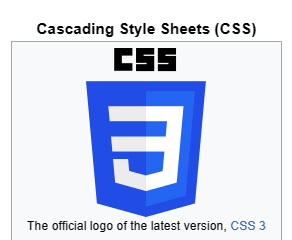

# HTML

What is HTML?

Per Wikipedia, "HyperText Markup Language or HTML is the standard markup language for documents designed to be displayed in a web browser. It defines the content and structure of web content. It is often assisted by technologies such as Cascading Style Sheets (CSS) and scripting languages such as JavaScript...

Web browsers receive HTML documents from a web server or from local storage and render the documents into multimedia web pages. HTML describes the structure of a web page semantically and originally included cues for its appearance," (https://en.wikipedia.org/wiki/HTML).

[WikipediaHTMLexample](https://upload.wikimedia.org/wikipedia/commons/thumb/6/61/HTML5_logo_and_wordmark.svg/120px-HTML5_logo_and_wordmark.svg.png)

# CSS

Cascading Style Sheets (CSS), per Wikipedia "is a style sheet language used for specifying the presentation and styling of a document written in a markup language such as HTML or XML...

CSS is designed to enable the separation of content and presentation, including layout, colors, and fonts.[3] This separation can improve content accessibility;[further explanation needed] provide more flexibility and control in the specification of presentation characteristics; enable multiple web pages to share formatting by specifying the relevant CSS in a separate .css file, which reduces complexity and repetition in the structural content; and enable the .css file to be cached to improve the page load speed between the pages that share the file and its formatting," (Wikipedia February 2024).

## What is the purpose of CSS?

Why do businesses use CSS vs HTML? 

HTML forms the layout/ framework, while CSS serves as the end result.

CSS is a way to create enhancements on your web page. CSS is one type of syntax software language. When a broser reads a style sheet, it will format the HTMl doc according to the info in the style sheet. 

 CSS improves your HTML-structured pages by adding the intricate parts of the visual finished product, enhancing the quality of the product.

 HTML is a language of symbols to allow text meaning (semantics) so that the browser knows how to display elements correctly in a language of sorts. HTML is used to define areas of your website (header, the navigation menu, column, etc.). 

## What are the three ways to use CSS in a project?

1. External which is a CSS source file in the HTML.
`<link rel="stylesheet" href="style.css">`
2. Internal which is CSS in the HTML document form itself.
3. Inline which provides the style and layout directly in the HTML element.
`
`

What is HTML and why do we use it? - A Hypertext Markup Language that helps structure the content of your web page. HTML is the code portion that we use to structure web pages with. It is in essence what you see when you are viewing the web page.

What are the 3 main parts of an HTML element? 
1. Opening Tag 

2. Contents 
content

3. Closing Tag 

What is it called when you give an element extra information? - Adding Attributes. It is the extra information and details about the element that you do not want in the content itself.

What is a semantic element? - It’s an element that defines the content within it. It gives meaning to the line of code itself. Semantics equals meaning. 

An example of semantic element follows: 

</h1>This is a top level heading</h1> (how the coding appears)

This is a top level heading (how it would appear on a web page)

Write an example of a CSS rule that would give all 
 elements red text.

Creating the paragraph text in red you could write: p { color: red; }

## Other Important Tips & Information
To turn all the paragraph element text red you could:
`p { color: red; }`
